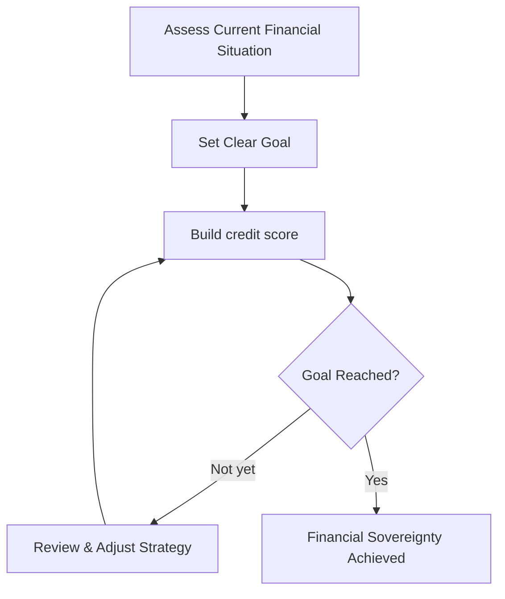

# credit score — Diagram

```mermaid
graph TD
    A[Assess Current Financial Situation] --> B[Set Clear Goal]
    B --> C[Build credit score]
    C --> D{Goal Reached?}
    D -->|Not yet| E[Review & Adjust Strategy]
    E --> C
    D -->|Yes| F[Financial Sovereignty Achieved]
```
